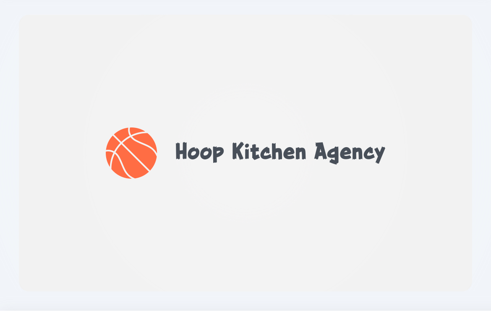

html

<!DOCTYPE html>
<html lang="en">
<head>
  <meta charset="UTF-8" />
  <meta name="viewport" content="width=device-width, initial-scale=1.0" />
  <title>Hoop Kitchen Agency</title>
  
</head>
<body>
  <header>
    
    
"Cooking up the best deals in basketball."

    <a href="#" class="button">Register for the Pro Showcase</a>
  </header>
  <section id="about">
    <h2>About Us</h2>
    

      Hoop Kitchen Agency is dedicated to helping basketball players begin, grow,
      and extend their professional careers around the world. We specialize in
      connecting talent with the right teams, organizations, and opportunities — 
      ensuring every player finds their perfect fit on and off the court.
        
      Built on integrity, preparation, and relationships, Hoop Kitchen believes
      in doing things the right way.
    

  </section>
  <section id="contact" class="contact">
    <h2>Contact Us</h2>
    
Email:
      <a href="mailto:hoopkitchenagency@gmail.com">hoopkitchenagency@gmail.com</a>
    

    
Instagram:
      <a href="https://instagram.com/hoopkitchenagency" target="_blank">@hoopkitchenagency</a>
    

  </section>
  <footer>
    © 2024 Hoop Kitchen Agency. All rights reserved.
  </footer>
</body>
</html>
